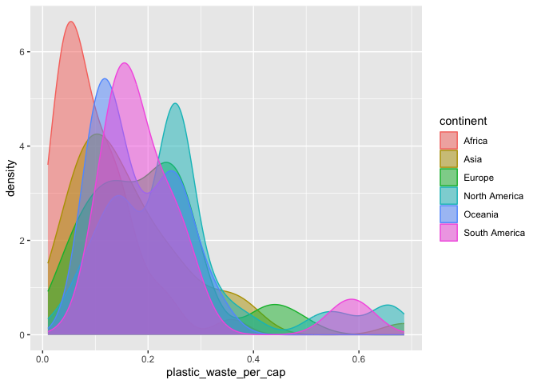
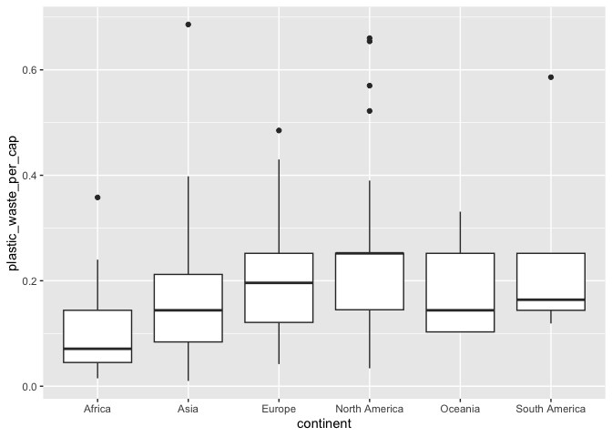
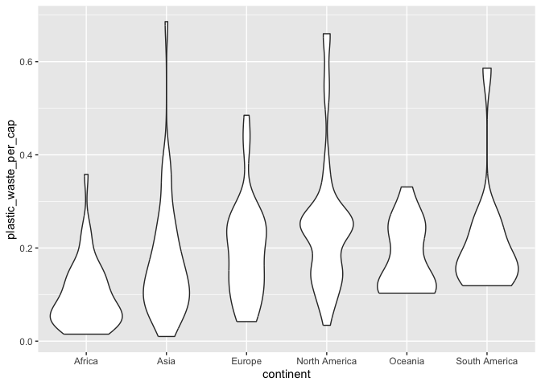
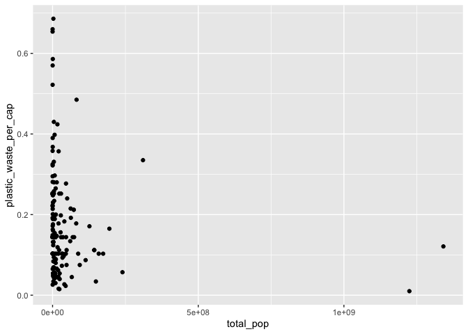
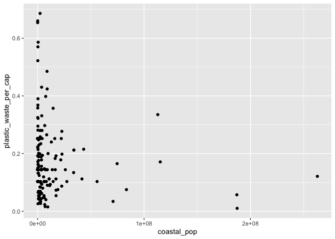
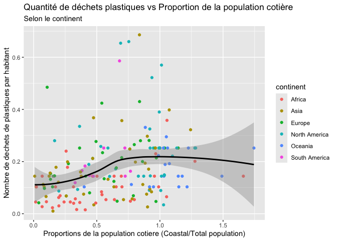

DAULOUDET BLANDINE
================
15/09/2025

## Chargement des packages et des données

``` r
library(tidyverse) 
```

``` r
plastic_waste <- read_csv("data/plastic-waste.csv")
```

Commençons par filtrer les données pour retirer le point représenté par
Trinité et Tobago (TTO) qui est un outlier.

``` r
plastic_waste <- plastic_waste %>%
  filter(plastic_waste_per_cap < 3.5)
```

## Exercices

### Exercise 1

``` r
ggplot(plastic_waste, aes(x= plastic_waste_per_cap, ))+ geom_histogram(binwidth =0.2) + facet_wrap(~continent)
```

<!-- -->
Question: Que pouvez vous dire de la comparaison des continents, en
terme de dechets plastique? Tout d’abord, en Afrique la majorité des
pays se situent proche de 0. Contrairement à l’Asie, L’Europe et
l’Amerique du Nord, l’Oceanie, l’Amerique du Sud la plus part des pays
se situent entre 0,10 et 0,25 kg de dechets par jour. De plus en
Amerique du Nord, il y a plus de pays qui ont plus que 0,50 kg de
dechets par jour. En Conclusion, les 3 continents qui produissent le
plus de dechets plastiques sont :l’Europe, l’Amerique du Nord et l’Asie.

### Exercise 2

``` r
# insert code here
library(ggplot2)
ggplot(plastic_waste, aes(x=plastic_waste_per_cap, fill = continent, color=continent)) + geom_density(ajust=2, alpha=0.5)
```

    ## Warning in geom_density(ajust = 2, alpha = 0.5): Ignoring unknown parameters:
    ## `ajust`

<!-- -->
Question: Decrivez pourquoi le reglage de la couleur et le reglage de la
transparence ne se trouvent pas au meme endroit ? Tout d’abord,le
reglage de la couleur va directement dans ka fonction aes() car celle ci
determine la proprité en fonction d’une propriété de donnée donc d’une
variable.Ce qui veux dire que chaque continent aura une coulur
differente. Tandis qu’alpha est dans la fonction geom() car celui ci
permet de fixer une propriété qui ne va pas dependre d’une variable dans
les données. Ce qui signifie que c’est un reglage qui va etre fixe pour
tout le graphique.Ici la transparence va etre la meme pour tout le
graphique.

### Exercise 3

Boxplot:

``` r
ggplot(plastic_waste, aes(x=continent, y=plastic_waste_per_cap))+ geom_boxplot()
```

<!-- -->

Violin plot:

``` r
ggplot(plastic_waste, aes(x=continent, y=plastic_waste_per_cap))+ geom_violin()
```

<!-- -->
Question: Qu’est ce que les violin plots permettent de voir sur les
données que les boxplot ne permettent pas? La principale difference est
que les violin plots sont plus visuels, ils ont une forme particulières
en fonction de la distributions de dechets par continent et habitant.
Donc ca nous permet de visualisé la distribution des données détaillé.

### Exercise 4

``` r
library(ggplot2)
ggplot(plastic_waste, aes(x=plastic_waste_per_cap, y=mismanaged_plastic_waste_per_cap, color=continent)) + geom_point()
```

<!-- -->
Question: Voyez vous une tendance ? On peut voir une tendance
croissante. On apercois que plus il y a de dechets par habitantS plus la
quantité de plastique non générés en tonne est elévee. Ce qui est
coherent.

### Exercise 5

``` r
ggplot(plastic_waste, aes(x=total_pop, y=plastic_waste_per_cap))+ geom_point()
```

    ## Warning: Removed 10 rows containing missing values or values outside the scale range
    ## (`geom_point()`).

<!-- -->

``` r
ggplot(plastic_waste, aes(x=coastal_pop, y=plastic_waste_per_cap)) +geom_point()
```

<!-- -->
Question: Est-ce qu’il semble y avoir une relation plus forte pour l’une
des paires de variables ? Oui il y a une légére variable plus forte avec
le nombre de personnes vivant sur les cotes et de plus le nombre de
dechets est plus variable. Mais c’est relativement les memes.

## Conclusion

Recréez la visualisation:

``` r
library(dplyr)
plastic_waste_coastal <- plastic_waste  %>%
  mutate(coastal_pop_prop = coastal_pop / total_pop)  %>%
  filter(plastic_waste_per_cap < 3)

ggplot(plastic_waste_coastal, aes(x=coastal_pop_prop,  y=plastic_waste_per_cap, color=continent))+ 
geom_point() +  stat_smooth(aes(group = 1), color="BLACK") +
labs(x= "Proportions de la population cotiere (Coastal/Total population)", y="Nombre de dechets de plastiques par habitant", title="Quantité de déchets plastiques vs Proportion de la population cotière",subtitle="Selon le continent")
```

    ## `geom_smooth()` using method = 'loess' and formula = 'y ~ x'

    ## Warning: Removed 10 rows containing non-finite outside the scale range
    ## (`stat_smooth()`).

    ## Warning: Removed 10 rows containing missing values or values outside the scale range
    ## (`geom_point()`).

<!-- --> Question:
Interpretez ce que vous observez. Nous pouvons voir que plus la
proportions de la population cotiere est élevée plus le nombre de
dechets plastique va etre augmenté. Cependant avec la ligne, nous
pouvons apercevoir que ce n’est pas forcement proportionelle, car
depassé un seuil de 1 le nombre de dechets commence petit a petit a se
stabiliser.
